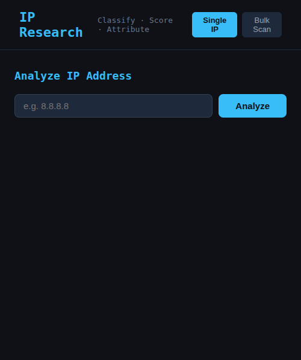
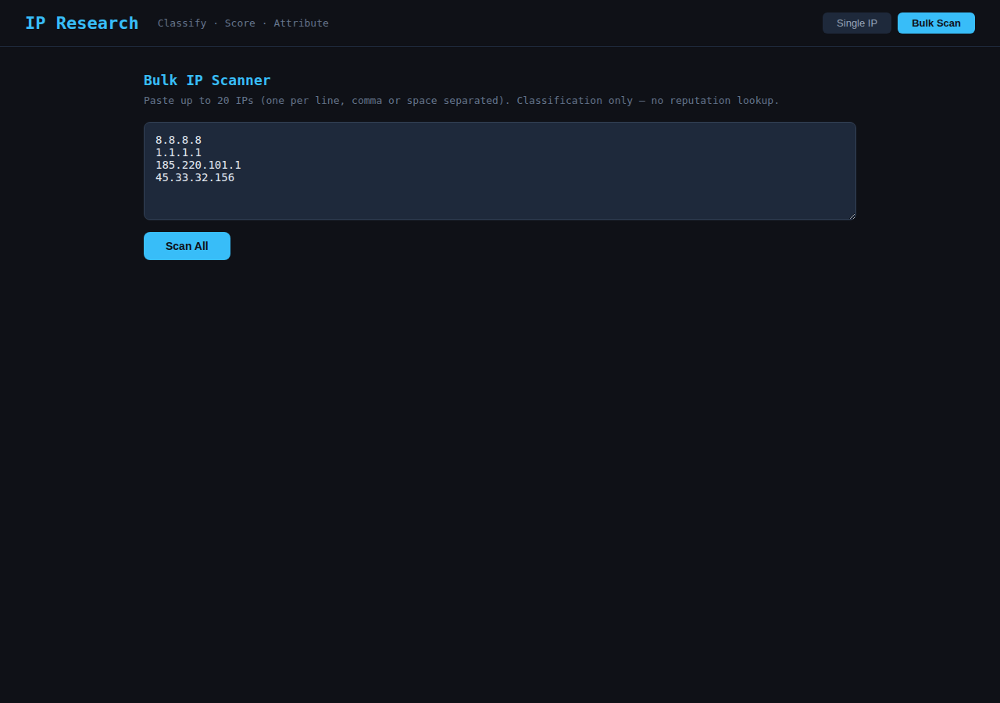

# IP Research Tool

[](https://github.com/hilaln2210/ip-research-tool/actions/workflows/ci.yml)

A dark-themed web app for classifying, scoring, and attributing IP addresses — built for security analysts, incident responders, and threat hunters. Analyze a single IP in depth or scan up to 20 at once in bulk.

## Screenshots

### Single IP Analysis


### Bulk IP Scanner


## Features

- **IP Classification** — Identifies IP type: Residential/ISP, Datacenter/Hosting, CDN, Proxy/VPN/Anonymizer, Mobile Carrier, CGNAT, Private/RFC-1918
- **Uniqueness Score (0–100)** — Rates how attributable the IP is to a single user/device, with detailed reasoning
- **Attribution Reliability Label** — High / Medium / Low / Very Low, based on score
- **ASN & Network Info** — AS number, ASN name, CIDR block, network name, ISP, org (via RDAP/ipwhois + ip-api.com)
- **Geo Data** — Country, region, city
- **Reverse DNS** — PTR record lookup; static vs. dynamic pattern detection
- **Threat Intel (optional, requires API keys)**
  - **AbuseIPDB** — Confidence score, total reports, abuse categories
  - **AlienVault OTX** — Pulse count, threat feeds referencing the IP (free, no key required)
  - **Shodan** — Open ports, CVEs, hostnames, tags
  - **VirusTotal** — Malicious/suspicious engine votes, reputation score
- **Bulk Scan** — Paste up to 20 IPs (one per line, comma, or space separated); classification-only mode for speed; exportable results
- **CSV Export** — Download bulk scan results as CSV
- **5-minute cache** — Backend caches results per IP to avoid hammering external APIs
- **Swagger UI** — Interactive API docs at `/docs`

## Tech Stack

| Layer | Technology |
|-------|-----------|
| Backend | Python 3.12, FastAPI, uvicorn |
| IP Data | ipwhois (RDAP), ip-api.com (free, no key) |
| Threat Intel | AbuseIPDB, AlienVault OTX, Shodan, VirusTotal |
| Frontend | React 18, Vite 5 |
| HTTP Client | httpx (async) |
| Styling | Inline CSS (dark monospace theme) |

## Prerequisites

- **Python 3.12+** with `venv`
- **Node.js 18+** and npm (or use [nvm](https://github.com/nvm-sh/nvm))
- No API keys required for basic usage (ip-api.com + OTX work out of the box)

## Quick Start

```bash
# Clone
git clone https://github.com/hilaln2210/ip-research-tool.git
cd ip-research-tool

# Start everything (backend on :8003, frontend on :3003)
./start.sh
```

Then open:
- **Frontend** → http://localhost:3003
- **Backend API** → http://localhost:8003
- **Swagger UI** → http://localhost:8003/docs

Stop with:
```bash
./stop.sh
```

## Manual Start

```bash
# Backend
cd backend
python3 -m venv venv
source venv/bin/activate
pip install -r requirements.txt
python3 -m uvicorn app.main:app --host 0.0.0.0 --port 8003 --app-dir .

# Frontend (separate terminal)
cd frontend
npm install
npm run dev   # default: port 3000
```

## API Keys (Optional)

Copy `.env.example` to `.env` in the `backend/` directory and fill in any keys you have:

```bash
cp backend/.env.example backend/.env
```

| Service | Env Variable | Free Tier |
|---------|-------------|-----------|
| AbuseIPDB | `ABUSEIPDB_KEY` | 1,000 checks/day |
| Shodan | `SHODAN_KEY` | Limited free |
| VirusTotal | `VIRUSTOTAL_KEY` | 500 req/day |
| AlienVault OTX | `OTX_API_KEY` | Free, key optional (higher rate limits) |

Without keys, only ip-api.com (classification/geo) and OTX (anonymous rate) are active.

## API Endpoints

| Method | Endpoint | Description |
|--------|----------|-------------|
| `GET` | `/api/analyze/{ip}` | Full analysis: classification + optional reputation (`?reputation=true`) |
| `POST` | `/api/bulk` | Bulk analyze up to 20 IPs (`{"ips": ["1.2.3.4", ...]}`) |
| `GET` | `/api/classify/{ip}` | Lightweight classification only (no reputation) |
| `GET` | `/api/health` | Health check |
| `GET` | `/docs` | Swagger UI |

## Project Structure

```
ip-research-tool/
├── backend/
│   ├── app/
│   │   ├── api/
│   │   │   └── routes.py          # API endpoints + caching
│   │   ├── services/
│   │   │   ├── ip_classifier.py   # Classification, uniqueness scoring
│   │   │   ├── reputation_service.py  # AbuseIPDB, OTX, Shodan, VirusTotal
│   │   │   └── known_ranges.py    # ASN/keyword lists
│   │   └── main.py
│   ├── requirements.txt
│   └── .env.example
├── frontend/
│   └── src/
│       ├── components/
│       │   ├── IPAnalyzer.jsx     # Single IP tab
│       │   ├── BulkAnalyzer.jsx   # Bulk scan tab
│       │   ├── ReputationPanel.jsx
│       │   ├── ScoreGauge.jsx
│       │   ├── FlagBadge.jsx
│       │   └── IPLookup.jsx
│       └── App.jsx
├── screenshots/
├── start.sh
├── stop.sh
└── README.md
```

## License

MIT — see [LICENSE](LICENSE).

---

## 🇮🇱 תיעוד בעברית

### מה הפרויקט עושה

**IP Research Tool** הוא כלי אנליזה לכתובות IP, מיועד לאנליסטי אבטחה, מגיבי אירועים וציידי איומים. הכלי מסווג כתובות IP, מדרג את רמת הייחודיות שלהן ומספק מידע מודיעיני ממקורות מרובים — הכל בממשק אפל ונוח לעין.

**תכונות עיקריות:**
- **סיווג IP** — מזהה סוג הכתובת: ביתי/ISP, מרכז נתונים, CDN, פרוקסי/VPN, מוביל סלולרי, CGNAT, רשת פרטית
- **ציון ייחודיות (0–100)** — מדרג עד כמה ניתן לייחס את הכתובת למשתמש/מכשיר ספציפי
- **תווית אמינות ייחוס** — גבוה / בינוני / נמוך / נמוך מאוד
- **מידע ASN ורשת** — מספר AS, שם ASN, בלוק CIDR, ISP וארגון
- **מיקום גיאוגרפי** — מדינה, אזור, עיר
- **DNS הפוך** — חיפוש רשומת PTR, זיהוי תבנית סטטית לעומת דינמית
- **מודיעין איומים (אופציונלי)** — AbuseIPDB, AlienVault OTX, Shodan, VirusTotal
- **סריקה מרוכזת** — ניתוח של עד 20 כתובות IP בו-זמנית, עם ייצוא ל-CSV
- **מטמון 5 דקות** — מונע קריאות חוזרות לאותו IP
- **Swagger UI** — תיעוד API אינטראקטיבי ב-`/docs`

### טכנולוגיות

| שכבה | טכנולוגיה |
|------|-----------|
| Backend | Python 3.12, FastAPI, uvicorn |
| נתוני IP | ipwhois (RDAP), ip-api.com (חינמי, ללא מפתח) |
| מודיעין איומים | AbuseIPDB, AlienVault OTX, Shodan, VirusTotal |
| Frontend | React 18, Vite 5 |
| HTTP Client | httpx (אסינכרוני) |
| עיצוב | CSS מוטבע (ערכת צבעים אפלה, גופן monospace) |

### הוראות התקנה והפעלה

**דרישות מוקדמות:**
- Python 3.12 ומעלה עם `venv`
- Node.js 18 ומעלה ו-npm (או nvm)
- אין צורך במפתחות API לשימוש בסיסי

**הפעלה מהירה:**
```bash
git clone https://github.com/hilaln2210/ip-research-tool.git
cd ip-research-tool
./start.sh
```

פתח:
- **ממשק משתמש** → http://localhost:3003
- **Backend API** → http://localhost:8003
- **Swagger UI** → http://localhost:8003/docs

עצור עם: `./stop.sh`

**הפעלה ידנית:**
```bash
# Backend
cd backend && python3 -m venv venv && source venv/bin/activate
pip install -r requirements.txt
python3 -m uvicorn app.main:app --host 0.0.0.0 --port 8003 --app-dir .

# Frontend (טרמינל נפרד)
cd frontend && npm install && npm run dev
```

**מפתחות API (אופציונלי):**
```bash
cp backend/.env.example backend/.env
# ערוך את backend/.env והוסף את המפתחות שלך
```

| שירות | משתנה סביבה | תוכנית חינמית |
|--------|-------------|---------------|
| AbuseIPDB | `ABUSEIPDB_KEY` | 1,000 בדיקות/יום |
| Shodan | `SHODAN_KEY` | חינמי מוגבל |
| VirusTotal | `VIRUSTOTAL_KEY` | 500 בקשות/יום |
| AlienVault OTX | `OTX_API_KEY` | חינמי, מפתח אופציונלי |

### מבנה הפרויקט

```
ip-research-tool/
├── backend/
│   ├── app/
│   │   ├── api/
│   │   │   └── routes.py              # נקודות API + מטמון
│   │   ├── services/
│   │   │   ├── ip_classifier.py       # סיווג וציון ייחודיות
│   │   │   ├── reputation_service.py  # AbuseIPDB, OTX, Shodan, VirusTotal
│   │   │   └── known_ranges.py        # רשימות ASN ומילות מפתח
│   │   └── main.py
│   ├── requirements.txt
│   └── .env.example                   # תבנית מפתחות API
├── frontend/
│   └── src/
│       ├── components/
│       │   ├── IPAnalyzer.jsx         # לשונית ניתוח IP יחיד
│       │   ├── BulkAnalyzer.jsx       # לשונית סריקה מרוכזת
│       │   ├── ReputationPanel.jsx    # פאנל מודיעין איומים
│       │   └── ScoreGauge.jsx         # מד ציון ייחודיות
│       └── App.jsx
├── screenshots/
├── start.sh                           # הפעלת backend ו-frontend יחד
├── stop.sh                            # עצירת כל התהליכים
└── README.md
```
